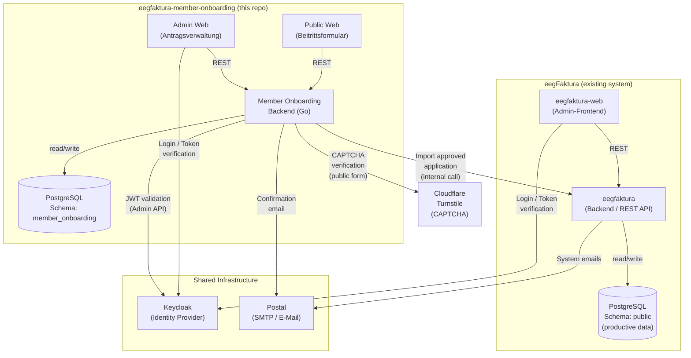
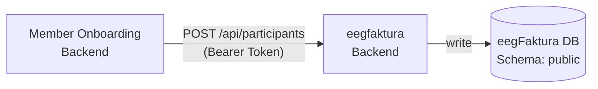
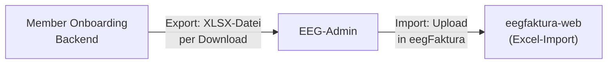
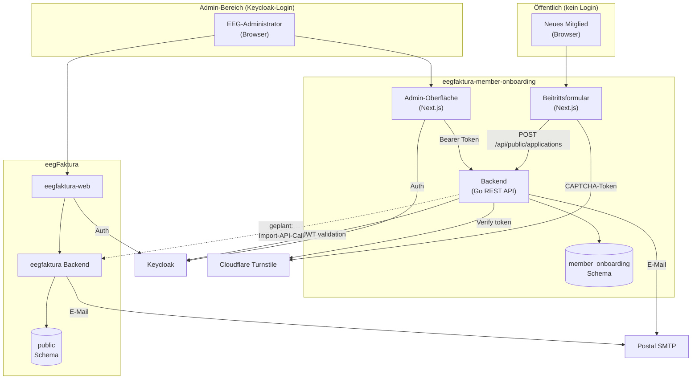

# Architecture Diagram: eegfaktura-member-onboarding

## System Context: Shared Infrastructure



---

## Current Integration Points and Risks

### 1. Keycloak (Auth)

| Aspekt | Detail |
|---|---|
| **Nutzung** | Admin-Login für `eegfaktura-web` und `eegfaktura-member-onboarding` |
| **Teilen** | Beide Systeme teilen dieselbe Keycloak-Instanz und denselben Realm |
| **Risiko** | Fällt Keycloak aus, ist der Admin-Bereich **beider** Systeme nicht erreichbar. Das öffentliche Beitrittsformular ist davon **nicht** betroffen (kein Login erforderlich). |
| **Risiko** | Keycloak-Konfigurationsänderungen (Realm-Einstellungen, Client-Config, Token-Lebensdauer) können beide Systeme gleichzeitig beeinflussen. |
| **Risiko** | Mandantentrennung erfolgt über Keycloak-Gruppen/Rollen; Fehlkonfigurationen könnten Admins aus verschiedenen EEGs auf fremde Daten zugreifen lassen. |
| **Maßnahme** | Monitoring: Keycloak-Health-Endpunkt überwachen. Konfigurationsänderungen vor Produktionseinsatz in Staging testen. |

### 2. Postal (SMTP / E-Mail)

| Aspekt | Detail |
|---|---|
| **Nutzung** | Bestätigungsemail an Mitglied + Benachrichtigungsemail an EEG bei neuem Antrag |
| **Teilen** | Beide Systeme verwenden dieselbe Postal-Instanz auf Port 25 (Port 587 gesperrt) |
| **Risiko** | Postal-Ausfall blockiert Bestätigungsemails. Der Antrag wird **dennoch** gespeichert – die E-Mail-Zustellung wird nicht für die Persistenz benötigt. |
| **Risiko** | Postal-Authentifizierungsprobleme (API-Key, Domain-Verifizierung) können die E-Mail-Zustellung ohne Hinweis unterbrechen. |
| **Risiko** | Shared Infrastructure: E-Mail-Konfigurationsfehler in einem System können die Zustellung auch für das andere System beeinflussen. |
| **Maßnahme** | E-Mail-Fehler werden geloggt (kein Silent Fail). SMTP-Verbindungsfehler sind im Backend-Log sichtbar. |

---

## Geplante zukünftige Integration: Import in eegFaktura Core

### Option A: Direkter API-Aufruf (intern)



| Aspekt | Detail |
|---|---|
| **Vorteil** | Vollständig automatisierbar, kein manueller Schritt |
| **Risiko** | **Enge Kopplung**: Änderungen an der eegFaktura-API erfordern Anpassungen im Onboarding-Backend. |
| **Risiko** | eegFaktura-API muss eine stabile, versionierte Schnittstelle für den internen Gebrauch bereitstellen. |
| **Risiko** | Netzwerkfehler oder API-Fehler können den Import-Schritt blockieren; Retry-Logik ist erforderlich. |
| **Risiko** | Auth-Token für den Service-to-Service-Call muss sicher verwaltet werden (Keycloak Service Account oder API-Key). |
| **Aktueller Status** | In der Architektur vorgesehen (`internal/coreclient`, `internal/importing`), aber **noch nicht implementiert**. |

### Option B: Excel-Export / Datei-Import (entkoppelt)



| Aspekt | Detail |
|---|---|
| **Vorteil** | **Vollständig entkoppelt**: Kein direkter API-Aufruf zwischen den Systemen. Änderungen an eegFaktura beeinflussen das Onboarding nicht. |
| **Vorteil** | Kein Netzwerkfehlerrisiko zwischen den Backends. |
| **Vorteil** | Admin behält volle Kontrolle und kann vor dem Import prüfen. |
| **Nachteil** | Manueller Schritt: Admin muss Export herunterladen und in eegFaktura importieren. |
| **Nachteil** | Kein Echtzeit-Feedback ob der Import erfolgreich war. |
| **Eignung** | Empfohlen als **kurzfristige Lösung** und für EEGs mit geringem Antragsvolumen. |

---

## Empfehlung: Phasenweises Vorgehen

```
Phase 1 (jetzt):       Excel-Export als Fallback / manuelle Option implementieren
                       → Niedrigstes Risiko, sofort nutzbar

Phase 2 (mittelfristig): Direkten API-Aufruf implementieren, wenn eegFaktura eine
                          stabile interne Import-API bereitstellt
                          → Parallel zum Excel-Export betreiben
                          → Automatisiert für Standard-Fälle

Phase 3 (langfristig):   Excel-Import als Fallback beibehalten (Fehlerbehandlung,
                          manuelle Korrekturen)
```

---

## Gesamtübersicht: Systemgrenzen und Verantwortlichkeiten



> **Legende:**
> - Durchgezogene Pfeile: bereits implementiert
> - Gestrichelte Pfeile: geplant, noch nicht implementiert
