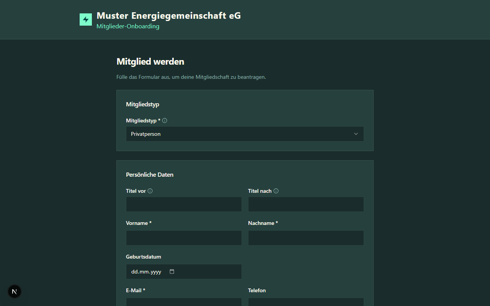
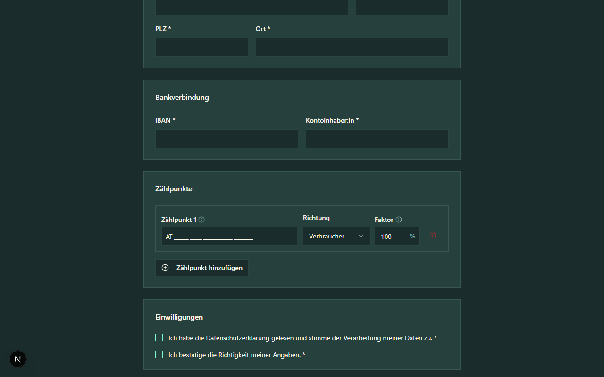

# Mitglieder-Registrierung (öffentliches Formular)

Diese Anleitung richtet sich an **neue EEG-Mitglieder**, die sich über das Online-Formular anmelden möchten.

## Schritt 1: Registrierungslink öffnen

Jede EEG hat einen eigenen Registrierungslink in der Form:

```
https://<deine-eeg-domain>/register/RC123456
```

Diesen Link erhältst du von deinem EEG-Betreiber (z.B. per E-Mail oder auf der Website der EEG).



## Schritt 2: Mitgliedstyp auswählen

Wähle den zutreffenden Mitgliedstyp:

| Typ | Beschreibung | USt.-Hinweis im Dropdown |
|-----|-------------|--------------------------|
| **Privatperson** | Natürliche Person | `(0 % USt.)` |
| **Pauschalierter Landwirt** | Land- und forstwirtschaftlicher Betrieb | `(13 % USt.)` |
| **Unternehmen** | Einzelunternehmer, GmbH, AG, OG, KG etc. — sowohl regulär umsatzsteuerpflichtig als auch Kleinunternehmerregelung (§ 6 Abs 1 Z 27 UStG) | `(0 % oder 20 % USt.)` |
| **Gemeinde / öffentliche Körperschaft** | Hoheitsbereich vs. Betrieb gewerblicher Art (BgA) | `(0 % oder 20 % USt.)` |
| **Verein** | Eingetragener Verein — ideeller Bereich vs. wirtschaftliche Tätigkeit | `(0 % oder 20 % USt.)` |

Je nach Mitgliedstyp werden unterschiedliche Felder angezeigt (z. B. Firmenname statt Vorname/Nachname). Der USt.-Hinweis in Klammern dient der Orientierung — er zeigt, welchen Steuersatz deine Rechnungen aus der EEG voraussichtlich tragen werden.

> **Kleinunternehmer-Pfad:** Wähle **Unternehmen** und lass die UID-Nummer leer — das signalisiert dem System die Kleinunternehmerregelung (0 % USt.). Mit ausgefüllter UID-Nummer wird der reguläre Unternehmenspfad (20 % USt.) angenommen. Eine separate „Kleinunternehmer"-Option gibt es seit Mai 2026 nicht mehr.

## Schritt 3: Persönliche Daten eingeben

Fülle alle Pflichtfelder aus (mit * markiert):

- **Vorname / Nachname** (bei Privatpersonen und Landwirten)
- **Firmenname** (bei Unternehmen, Gemeinden, Vereinen)
- **E-Mail-Adresse** — hieran erhältst du die Einreichungsbestätigung
- **Telefon** (optional, sofern von deiner EEG aktiviert)
- **Wohnadresse** (Straße, Hausnummer, PLZ, Ort)

## Schritt 4: Bankverbindung eingeben

Gib deine IBAN und den Kontoinhaber an. Mit dem Setzen des Häkchens bei **SEPA-Lastschriftmandat** erteilst du der EEG die Erlaubnis, Beiträge einzuziehen.

> **Hinweis:** IBANs aus allen SEPA-Ländern werden akzeptiert (AT, DE, CH, etc.).

## Schritt 5: Zählpunkte angeben



Gib mindestens einen Zählpunkt an. Pro Zählpunkt-Eintrag erscheinen die Felder in zwei Zeilen — zuerst **Richtung** und **Teilnahmefaktor** in einer Zeile, darunter die volle **Zählpunktnummer**. Das ist Absicht: die Richtung bestimmt die Eingabe-Mask der Zählpunktnummer (siehe unten).

- **Richtung** — Verbraucher (Strom wird bezogen) oder Erzeuger (Strom wird eingespeist)
- **Teilnahmefaktor** — prozentualer Anteil der Teilnahme an der EEG (Standard: 100 %)
- **Zählpunktnummer** — 33-stellige Nummer im Format `AT...` in der offiziellen E-Control-Gruppierung `2-6-5-20` (steht auf deiner Stromrechnung). Die letzten 20 Stellen können Großbuchstaben und Ziffern enthalten.
  - **Prefix-Vorbelegung**: Wenn deine EEG einen Zählpunkt-Prefix für die gewählte Richtung konfiguriert hat, ist dieser bereits eingetragen und kann nicht überschrieben werden — du tippst nur die individuellen letzten Stellen.
  - **Auto-Pad**: Wenn du das Eingabefeld verlässt und weniger Stellen als nötig eingetippt hast, werden fehlende Stellen automatisch mit führenden Nullen zwischen Prefix und deiner Eingabe ergänzt.
  - **Richtungs-Wechsel** löscht das Zählpunkt-Feld, damit der korrekte Prefix für die neue Richtung greifen kann.
- **Erzeugungsform** *(nur bei Erzeuger-Zählpunkten)* — Auswahl PV / Wasser / Wind / Biomasse, Default PV
- **Batteriespeicher vorhanden** *(nur bei PV-Erzeugern)* — Master-Checkbox: nach dem Aktivieren erscheinen die drei Speicher-Felder gemeinsam:
  - **Größe Batterie (kWh)** *(sofern die EEG das Feld konfiguriert hat)*
  - **Hersteller Wechselrichter** *(sofern die EEG das Feld konfiguriert hat)*
  - **Speichersteuerung im Sinne der EEG vorstellbar?** *(sofern die EEG das Feld konfiguriert hat)* — Ja-/Nein-Häkchen: die EEG könnte deinen Heimspeicher gemeinsam mit anderen Speichern der Mitglieder so steuern, dass die Erzeugung innerhalb der Gemeinschaft optimal genutzt wird. Eine konkrete Steuerung wird separat abgestimmt; das Häkchen ist nur deine grundsätzliche Bereitschaft.
- **Verbrauch Vorjahr / Verbrauch Prognose (kWh)** *(nur bei Verbraucher-Zählpunkten)*
- **Einspeisung Prognose (kWh/Jahr)** *(nur bei Erzeuger-Zählpunkten)*
- **PV-Leistung (kWp)** *(nur bei Erzeuger-Zählpunkten mit Erzeugungsform PV)*
- **Einspeiselimit** *(nur bei PV-Erzeugern)* — Checkbox „Einspeiselimit vorhanden". Bei Ja erscheint ein Eingabefeld für den maximalen Einspeisewert in kW. Hintergrund: manche Netzanschlüsse sind leistungstechnisch beschränkt, sodass nur ein Teil der erzeugten PV-Leistung tatsächlich ins Netz eingespeist werden darf.
- **Abweichende Adresse** *(optional)* — Checkbox einblendet vier Adressfelder, wenn der Zählpunkt nicht an deiner Wohnadresse liegt. Alle vier Felder müssen ausgefüllt werden, sobald die Checkbox aktiviert ist.

Über **Zählpunkt hinzufügen** kannst du bis zu 10 Zählpunkte angeben.

### Schritt 5b: Weitere Angaben *(typabhängig)*

Nach der Zählpunkt-Eingabe erscheint — sofern deine EEG die zugehörigen Felder konfiguriert hat — der Block „Weitere Angaben". Welche Felder dort sichtbar sind, hängt vom Typ deiner Zählpunkte ab:

- **Verbraucher-Zählpunkt vorhanden:** „Personen im Haushalt", „Wärmepumpe", „E-Auto" (+ optional Anzahl/Jahres-km, falls E-Auto = Ja), „Warmwasser elektrisch"
- Bei reinen Erzeuger-Anträgen werden diese Verbraucher-Felder ausgeblendet.

> **Hinweis:** Die früheren Application-Level-Felder „Verbrauch Vorjahr/Prognose", „Einspeisung Prognose" und „PV-Leistung (kWp)" werden jetzt **pro Zählpunkt** abgefragt — direkt im jeweiligen Zählpunkt-Block des Formulars, nicht mehr hier im allgemeinen Abschnitt. Bei mehreren Verbraucher- oder Erzeuger-Zählpunkten gibt es entsprechend mehrere Eingaben.

## Schritt 5a: Genossenschaftsanteile (nur bei aktivierten EEGs)

Wenn deine EEG als Genossenschaft organisiert ist und in den Einstellungen die Anteils-Erfassung aktiviert hat, erscheint ein zusätzlicher Block **„Genossenschaftsanteile"** im Formular:

- **Pflichtanteil je Standort** — der von der EEG festgelegte Mindestwert (z.B. „1 Anteil"). Reiner Hinweistext, kann nicht geändert werden.
- **Anzahl Anteile gesamt** — Eingabefeld, vorbefüllt mit dem Pflichtwert. Du kannst den Wert nach oben überschreiben (mehr Anteile freiwillig zeichnen), aber nicht darunter.
- **Genossenschaftsanteilswert** und **Gesamtbetrag** werden live berechnet und unterhalb angezeigt (z.B. „€ 100,00 × 3 = € 300,00").

Wenn deine EEG dieses Feature nicht aktiviert hat, ist der Block ausgeblendet und du kannst diesen Schritt überspringen.

## Schritt 6: Datenschutz und Einreichung

- Stimme der **Datenschutzerklärung** zu
- Bestätige die **Richtigkeit deiner Angaben**
- Falls deine EEG zusätzliche Pflicht-Dokumente hinterlegt hat (z. B. Satzung), bestätige diese ebenfalls per Häkchen
- Falls deine EEG **Info-Dokumente** verlinkt hat (z. B. Mitgliederinfo, Hausordnung), werden diese nur zur Kenntnisnahme angezeigt — kein Häkchen, aber das Einreichen des Antrags gilt als Kenntnisnahme
- Falls deine EEG die **Netzbetreiber-Vollmacht** verlangt, lies den Volltext der Vollmacht und bestätige sie per Häkchen — damit ermächtigst du die EEG, in deinem Namen Abstimmungen mit dem Netzbetreiber durchzuführen
- Klicke auf **Antrag einreichen**

Nach der Einreichung erhältst du eine **Bestätigungs-E-Mail** mit deiner Antragsnummer (Format `<RC>-<Jahr>-<NNNN>`, z. B. `RC123456-2026-0001`). Die E-Mail enthält zusätzlich:

* eine PDF-Zusammenfassung deiner Angaben,
* eine Identifikations-Fußzeile mit deiner EEG, damit du die Mail eindeutig zuordnen kannst,
* eine **Reply-To**-Adresse, über die du direkt mit deiner EEG in Kontakt treten kannst (Antworten gehen nicht an einen „noreply"-Postfach).

## Schritt 7: E-Mail-Adresse bestätigen (nur bei aktivierten EEGs)

Wenn deine EEG das Feature **„E-Mail-Bestätigung erforderlich"** aktiviert hat, enthält deine Bestätigungs-Mail zusätzlich einen gelben Hinweisblock mit einem Button **„E-Mail-Adresse bestätigen"**. Der Link ist 30 Tage gültig. Erst nach dem Klick wird dein Antrag von der EEG bearbeitet.

In diesem Fall zeigt die Erfolgsmeldung direkt nach dem Einreichen den Hinweis **„Bitte prüfe jetzt dein E-Mail-Postfach und bestätige deine E-Mail-Adresse über den zugesandten Link."** statt der Standard-Meldung „wird nun von unserem Team geprüft".

Ist das Feature in deiner EEG deaktiviert, entfällt dieser Schritt — der Antrag geht direkt in die Bearbeitung.

## Was passiert nach der Einreichung?

Dein Antrag wird nun vom EEG-Betreiber geprüft. Mögliche nächste Schritte:

- **Rückfragen:** Der EEG-Betreiber kann dich um Ergänzungen bitten. Du erhältst eine E-Mail mit den Rückfragen und kannst deinen Antrag ergänzen.
- **Genehmigung:** Dein Antrag wird genehmigt und in eegFaktura importiert.
- **Ablehnung:** In Ausnahmefällen kann ein Antrag abgelehnt werden.
