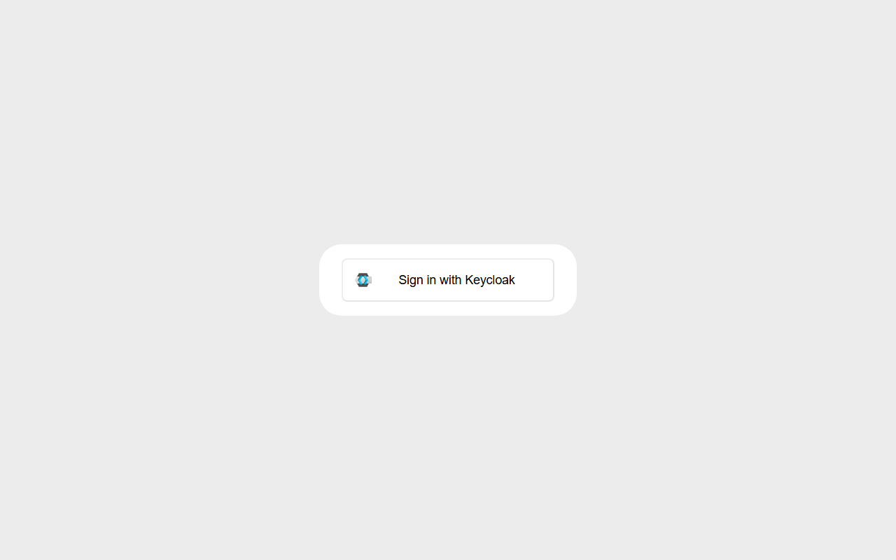
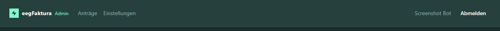

# Anmeldung in der Admin-Oberfläche

## Voraussetzungen

Um die Admin-Oberfläche nutzen zu können, benötigst du:
- Einen Keycloak-Benutzeraccount (wird vom Systembetreiber eingerichtet)
- Das Attribut `tenant` mit den RC-Nummern deiner EEG(s) in deinem Benutzeraccount

Wende dich an deinen Systembetreiber, falls du noch keinen Zugang hast.

## Anmeldung

1. Öffne die Admin-Oberfläche unter `https://<deine-domain>/admin`
2. Du wirst automatisch zur Keycloak-Anmeldeseite weitergeleitet

3. Gib deinen Benutzernamen und dein Passwort ein
4. Nach erfolgreicher Anmeldung wirst du zur Antragsübersicht weitergeleitet

## Welche EEGs sehe ich?

Als EEG-Betreiber siehst du ausschließlich die Anträge jener EEGs, die in deinem Keycloak-Account hinterlegt sind. Es ist nicht möglich, Anträge anderer EEGs einzusehen.

## Sitzungsablauf

Aus Sicherheitsgründen läuft deine Anmelde-Sitzung nach einiger Zeit ab. Wenn du nach Ablauf eine Aktion ausführst (z. B. einen Antrag öffnen), wirst du automatisch zur Keycloak-Anmeldeseite zurückgeleitet, um deine Sitzung zu erneuern. Nach erfolgreicher Re-Authentifizierung landest du wieder in der Admin-Oberfläche.

Sollte die automatische Re-Anmeldung selbst fehlschlagen (z. B. weil das Backend gerade einen Neustart durchführt), wird die Weiterleitung für 30 Sekunden ausgesetzt, um Endlos-Schleifen zu vermeiden. Versuche es danach erneut oder lade die Seite neu.

## Abmeldung

Klicke oben rechts auf **Abmelden**, um dich sicher aus der Admin-Oberfläche abzumelden.

