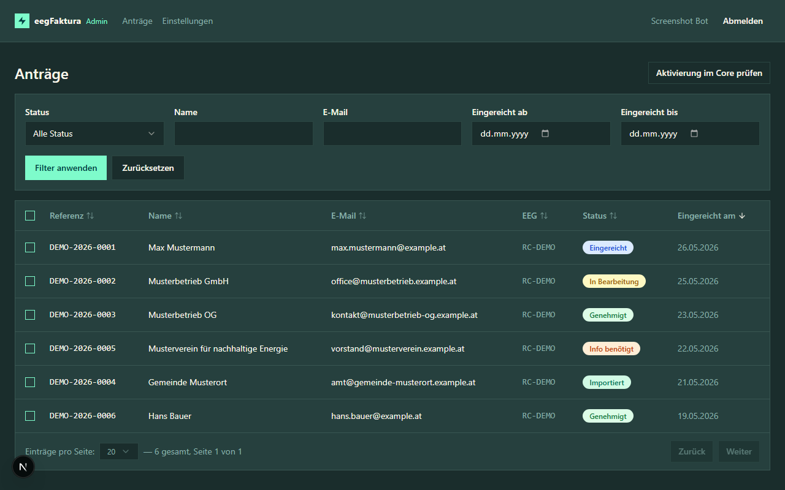
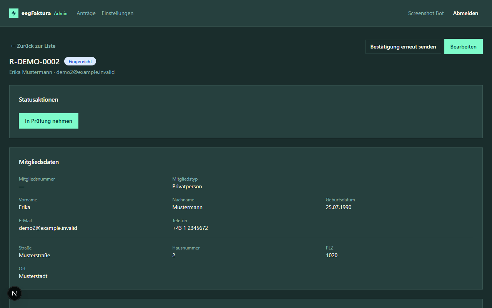
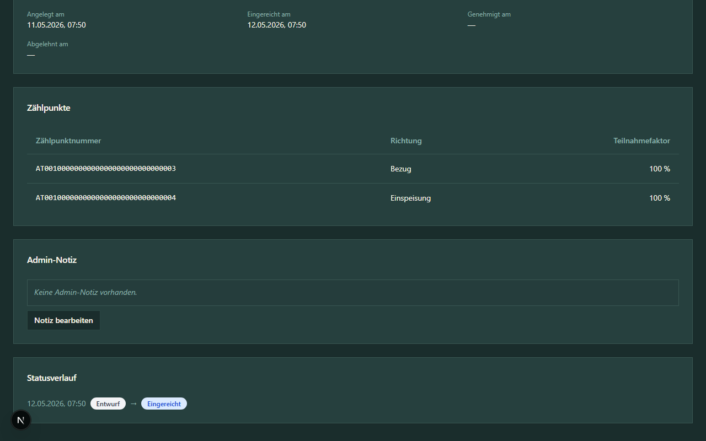

# Anträge verwalten

## Antragsübersicht

Nach der Anmeldung sehen Sie die **Antragsübersicht** mit allen eingereichten Anträgen Ihrer EEG(s).

Die Tabelle zeigt:
- **Antragsnummer** — eindeutige Kennung des Antrags
- **EEG** — RC-Nummer der zugehörigen EEG
- **Mitglied** — Name oder Firmenname
- **E-Mail** — Kontaktadresse des Mitglieds
- **Mitgliedsnummer** — Wird erst beim Import vergeben und kann alphanumerisch sein (z. B. `A005`). Vor dem Import bleibt die Spalte leer.
- **Status** — aktueller Bearbeitungsstand
- **Eingereicht am** — Datum und Uhrzeit der Einreichung (Anzeige in Europe/Vienna)

## Anträge filtern

Über das **Filterpanel** können Sie die Anträge gezielt einschränken:

| Filter | Beschreibung |
|--------|-------------|
| **Status** | Nur Anträge mit einem bestimmten Status anzeigen |
| **Name** | Suche nach Familienname des Mitglieds |
| **E-Mail** | Suche nach E-Mail-Adresse |
| **EEG** | Nur Anträge einer bestimmten EEG anzeigen (erscheint bei mehreren EEGs) |
| **Eingereicht von/bis** | Zeitraum der Einreichung |

## Sortieren

Klicken Sie auf eine Spaltenüberschrift, um die Liste nach dieser Spalte zu sortieren:

* Erster Klick → aufsteigend (Pfeil ↑)
* Zweiter Klick → absteigend (Pfeil ↓)
* Dritter Klick → Standardsortierung (Pfeil ↕)

Die aktuelle Sortierung wird im Link in der Adressleiste mitgeführt, sodass Sie sortierte Ansichten teilen oder als Lesezeichen speichern können.

## Antrag öffnen

Klicken Sie auf eine Zeile in der Tabelle, um die **Detailansicht** des Antrags zu öffnen.

## Detailansicht

Die Detailansicht zeigt alle Angaben des Mitglieds:

- **Statusaktionen** — verfügbare Aktionen je nach aktuellem Status
- **Mitgliedsdaten** — Mitgliedstyp, Name, Geburtsdatum, Kontakt, Adresse
- **Bankverbindung** — IBAN, Kontoinhaber, SEPA-Mandat
- **Einwilligungen** — Datenschutz und Richtigkeitsbestätigung
- **Antragsdaten** — Referenznummer, RC-Nummer, Mitgliedsnummer (nach erfolgreichem Import), Zeitstempel
- **Zählpunkte** — alle angegebenen Zählpunkte mit Richtung und Teilnahmefaktor
- **Admin-Notiz** — interne Notizen (nur für Admins sichtbar)
- **Statusverlauf** — chronologische Historie aller Statusänderungen

## Antrag bearbeiten

Als Admin können Sie folgende Felder direkt korrigieren:

- Persönliche Daten und Adresse
- IBAN und Kontoinhaber
- Zählpunkte
- Admin-Notiz (interne Anmerkungen)

Klicken Sie auf **Bearbeiten**, nehmen Sie die Änderungen vor und speichern Sie.

> **Hinweis:** Änderungen an Antragsdaten werden im Statusverlauf nicht automatisch protokolliert. Nutzen Sie die Admin-Notiz für wichtige Vermerke.

> **Hinweis:** Das Speichern der Admin-Notiz aktualisiert ausschließlich das Notizfeld — andere Antragsdaten (Mitgliedstyp, Zählpunkte, Teilnahmefaktor, …) werden dabei nicht überschrieben.

## Entwürfe löschen

Wenn ein Mitglied einen Antrag begonnen, aber nie eingereicht hat (Status `draft`), können Sie ihn aus der Übersicht entfernen. Die Massen-Löschaktion respektiert dabei den aktiven **EEG-Filter**:

* Filter auf eine bestimmte EEG gesetzt → nur Entwürfe dieser EEG werden gelöscht
* Kein EEG-Filter gesetzt (Superuser) → Entwürfe aller EEGs werden gelöscht

## E-Mail erneut senden

Falls ein Mitglied die Bestätigungs-E-Mail nicht erhalten hat, können Sie diese über den Button **E-Mail erneut senden** in der Detailansicht nochmals versenden.
