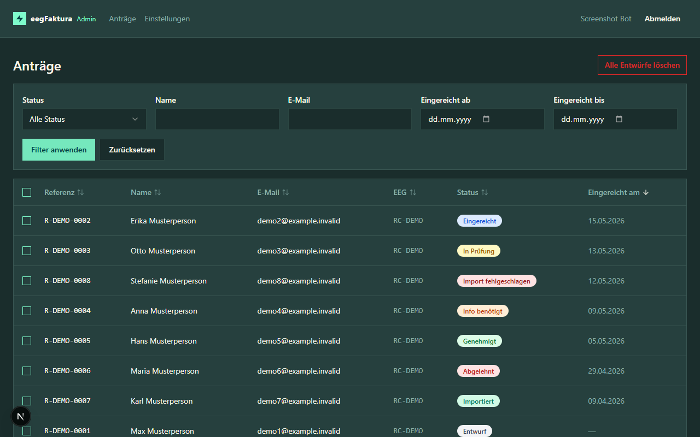
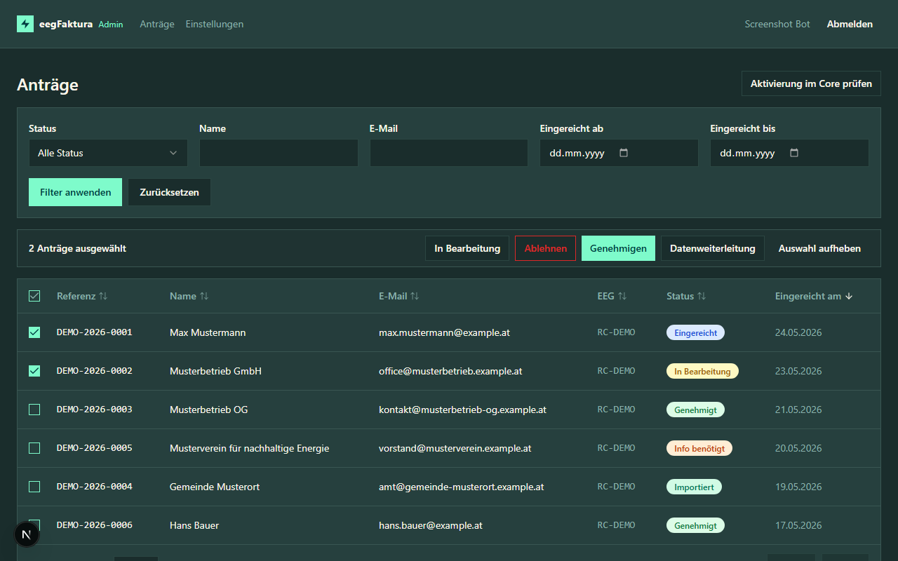
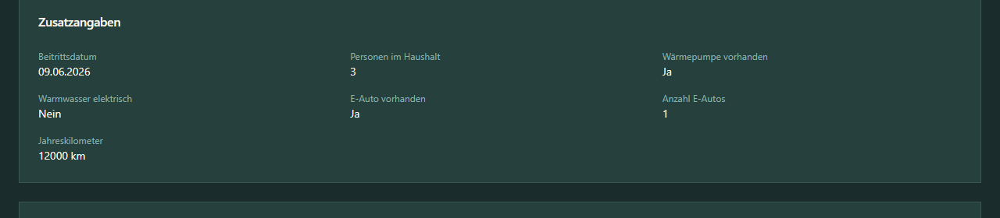
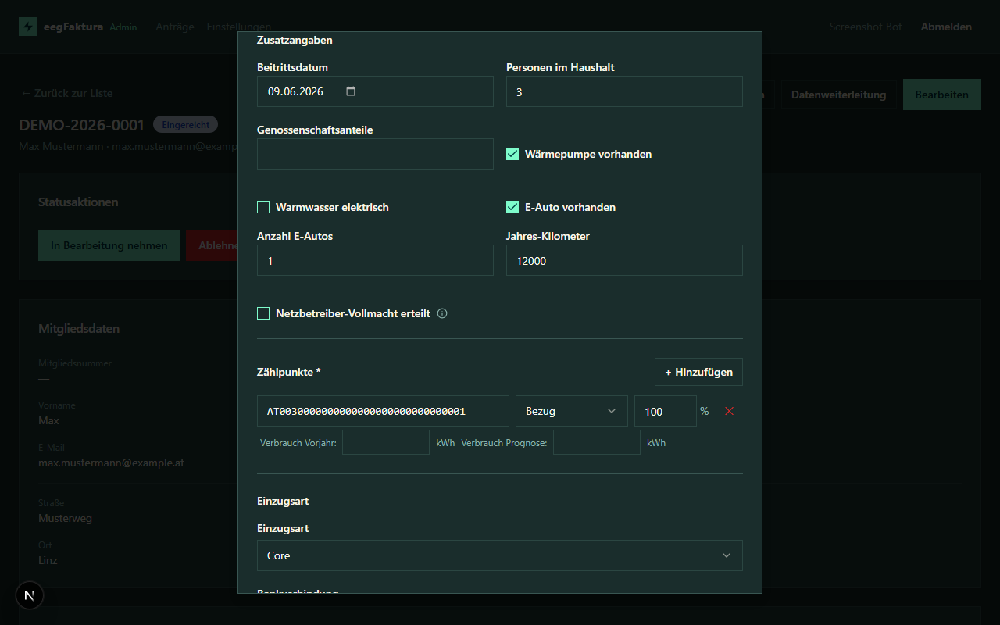

# Anträge verwalten

## Antragsübersicht

Nach der Anmeldung siehst du die **Antragsübersicht** mit allen eingereichten Anträgen deiner EEG(s).

### Toolbar-Aktionen

Rechts oben in der Übersicht stehen dir zwei Aktionen zur Verfügung:

- **„Aktivierung im Core prüfen"** — fragt für alle Anträge im Status „Bereit zur Aktivierung" beim eegFaktura-Core nach. Das **Auslöse-Kriterium** ist pro EEG konfigurierbar (Einstellungen → „Aktivierungs-Kriterium"):
  - *Variante A* (Default): Mitglied im Core ist auf Status `ACTIVE`.
  - *Variante B*: mindestens ein Zählpunkt im Core hat `processState` in PENDING/APPROVED/ACTIVE (Netzbetreiber hat geantwortet).

  Trifft das Kriterium zu, wird der Antrag automatisch auf **„Aktiviert"** gesetzt und das Mitglied bekommt die volle Beitrittsbestätigungs-Mail mit PDF. Toast zeigt das Ergebnis (z. B. „3 von 5 auf Aktiviert gesetzt") und die Liste wird neu geladen.
- **„Alle Entwürfe löschen"** — erscheint nur, wenn Entwürfe existieren; löscht unwiderruflich alle nicht eingereichten Anträge deiner EEG(s).

Die Tabelle zeigt:
- **Referenznummer** — eindeutige Kennung des Antrags
- **Name** — Mitgliedsname oder Firmenname
- **E-Mail** — Kontaktadresse des Mitglieds
- **EEG** — RC-Nummer der zugehörigen EEG
- **Status** — aktueller Bearbeitungsstand
- **Eingereicht am** — Datum und Uhrzeit der Einreichung (Anzeige in Europe/Vienna)

Die Mitgliedsnummer ist nicht in der Liste, sondern erst in der Detailansicht eines Antrags sichtbar (sie wird erst beim Import vergeben und kann alphanumerisch sein, z. B. `A005`).

## Anträge filtern

Über das **Filterpanel** kannst du die Anträge gezielt einschränken:

| Filter | Beschreibung |
|--------|-------------|
| **Status** | Nur Anträge mit einem bestimmten Status anzeigen (Entwurf, Eingereicht, E-Mail bestätigt, In Bearbeitung, Info benötigt, Genehmigt, Abgelehnt, Importiert, Import fehlgeschlagen, **Warte auf Bank-Bestätigung**, **Bereit zur Aktivierung**, **Aktiviert**) |
| **Name** | Teilsuche über Vorname, Nachname und Firmenname (z. B. findet „Must" sowohl „Max Mustermann" als auch eine Firma „Musterbetrieb GmbH") |
| **E-Mail** | Teilsuche in der E-Mail-Adresse |
| **EEG** | Nur Anträge einer bestimmten EEG anzeigen (erscheint nur bei Admins mit mehreren EEGs) |
| **Eingereicht ab / bis** | Zeitraum der Einreichung (Datumsbereich) |

## Massenaktionen

Über die Checkbox am Zeilenanfang kannst du mehrere Anträge gleichzeitig auswählen. Sobald mindestens ein Antrag selektiert ist, erscheint eine Aktionsleiste:

| Aktion | Wirkung |
|---|---|
| **In Bearbeitung** | Setzt alle ausgewählten Anträge auf `under_review`. Übersprungen werden Anträge, die diesen Übergang nicht erlauben. |
| **Genehmigen** | Setzt alle erlaubten Anträge auf `approved`. |
| **Ablehnen** | Setzt alle erlaubten Anträge auf `rejected` — eine Begründung wird abgefragt und am Antrag protokolliert. |
| **Datenweiterleitung** | Startet einen Datenexport-Job für die ausgewählten Anträge (siehe Einstellungen → [Datenweiterleitung](06-admin-settings.md#datenweiterleitung)). |
| **Auswahl aufheben** | Setzt die Auswahl zurück. |

Ein Toast zeigt nach der Aktion, wie viele Anträge tatsächlich umgesetzt wurden und wie viele übersprungen wurden (z. B. weil sie schon im Zielstatus waren).

## Sortieren

Klicke auf eine Spaltenüberschrift, um die Liste nach dieser Spalte zu sortieren:

* Erster Klick → aufsteigend (Pfeil ↑)
* Zweiter Klick → absteigend (Pfeil ↓)
* Dritter Klick → Standardsortierung (Pfeil ↕)

Die aktuelle Sortierung wird im Link in der Adressleiste mitgeführt, sodass du sortierte Ansichten teilen oder als Lesezeichen speichern kannst.

## Antrag öffnen

Klicke auf eine Zeile in der Tabelle, um die **Detailansicht** des Antrags zu öffnen.

## Detailansicht

Die Detailansicht zeigt alle Angaben des Mitglieds:

- **Statusaktionen** — verfügbare Aktionen je nach aktuellem Status
- **Mitgliedsdaten** — Mitgliedstyp, Name, Geburtsdatum, Kontakt, Adresse
- **Zusatzangaben** — Beitrittsdatum, Personen im Haushalt, Wärmepumpe, E-Auto (inkl. Anzahl + Jahres-km), Warmwasser elektrisch. Die Karte erscheint nur, wenn die EEG mindestens eines dieser Felder im Mitglieder-Formular aktiviert hat und das Mitglied einen Wert eingetragen hat.

- **Bankverbindung** — IBAN, Kontoinhaber, SEPA-Mandat
- **Einwilligungen** — Datenschutz und Richtigkeitsbestätigung
- **Antragsdaten** — Referenznummer, RC-Nummer, Mitgliedsnummer (nach erfolgreichem Import), Zeitstempel
- **Zählpunkte** — alle angegebenen Zählpunkte mit Richtung und Teilnahmefaktor
- **Admin-Notiz** — interne Notizen (nur für Admins sichtbar)
- **Statusverlauf** — chronologische Historie aller Statusänderungen

## Antrag bearbeiten

Als Admin kannst du folgende Felder direkt korrigieren:

- Persönliche Daten und Adresse
- IBAN und Kontoinhaber
- Zählpunkte
- **Zusatzangaben** — Beitrittsdatum, Personen im Haushalt, Wärmepumpe, Warmwasser elektrisch, E-Auto (inkl. Anzahl + Jahres-km), Genossenschaftsanteile, Netzbetreiber-Vollmacht. Es werden nur die Felder angezeigt, die in den EEG-Einstellungen unter „Formular-Felder" auf „Optional", „Pflicht" oder „Nur Admin" stehen. Ein Feld mit Status „Ausgeblendet" erscheint weder im Mitglieder-Formular noch im Admin-Edit-Dialog — soll ein hidden-Feld vom Admin pflegbar werden, setze es in den Einstellungen auf „Nur Admin". Beim Deaktivieren des E-Auto-Toggles werden Anzahl und Jahres-Kilometer serverseitig gelöscht. Der Zeitstempel der Netzbetreiber-Vollmacht wird beim ersten Setzen serverseitig vergeben; ein nachträgliches Entfernen des Toggles ändert die Audit-Spur nicht.
- Admin-Notiz (interne Anmerkungen)

Klicke auf **Bearbeiten**, nimm die Änderungen vor und speichere.

> **Hinweis:** Änderungen an Antragsdaten werden im Statusverlauf nicht automatisch protokolliert. Nutze die Admin-Notiz für wichtige Vermerke.

> **Hinweis:** Das Speichern der Admin-Notiz aktualisiert ausschließlich das Notizfeld — andere Antragsdaten (Mitgliedstyp, Zählpunkte, Teilnahmefaktor, …) werden dabei nicht überschrieben.

## Entwürfe löschen

Wenn ein Mitglied einen Antrag begonnen, aber nie eingereicht hat (Status `draft`), kannst du ihn aus der Übersicht entfernen. Die Massen-Löschaktion respektiert dabei den aktiven **EEG-Filter**:

* Filter auf eine bestimmte EEG gesetzt → nur Entwürfe dieser EEG werden gelöscht
* Kein EEG-Filter gesetzt (Superuser) → Entwürfe aller EEGs werden gelöscht

## E-Mail erneut senden

Falls ein Mitglied die Bestätigungs-E-Mail nicht erhalten hat, kannst du diese über den Button **E-Mail erneut senden** in der Detailansicht nochmals versenden.

## EEG umzuordnen

Falls ein Antrag fälschlich der falschen EEG zugeordnet wurde (Mitglied hat den falschen RC-Link verwendet), kann er als Admin direkt umzuordnen werden — ohne dass das Mitglied neu einreichen muss. Verfügbar nur für Admins mit Zugriff auf mehrere EEGs und nur solange der Antrag in der Review-Phase ist (`submitted` / `email_confirmed` / `under_review` / `needs_info`). Detail-Beschreibung siehe [Statusverwaltung → EEG umzuordnen](05-admin-status.md#eeg-umzuordnen).
