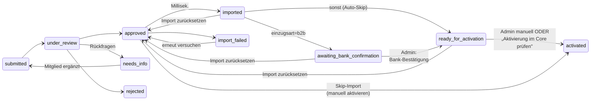
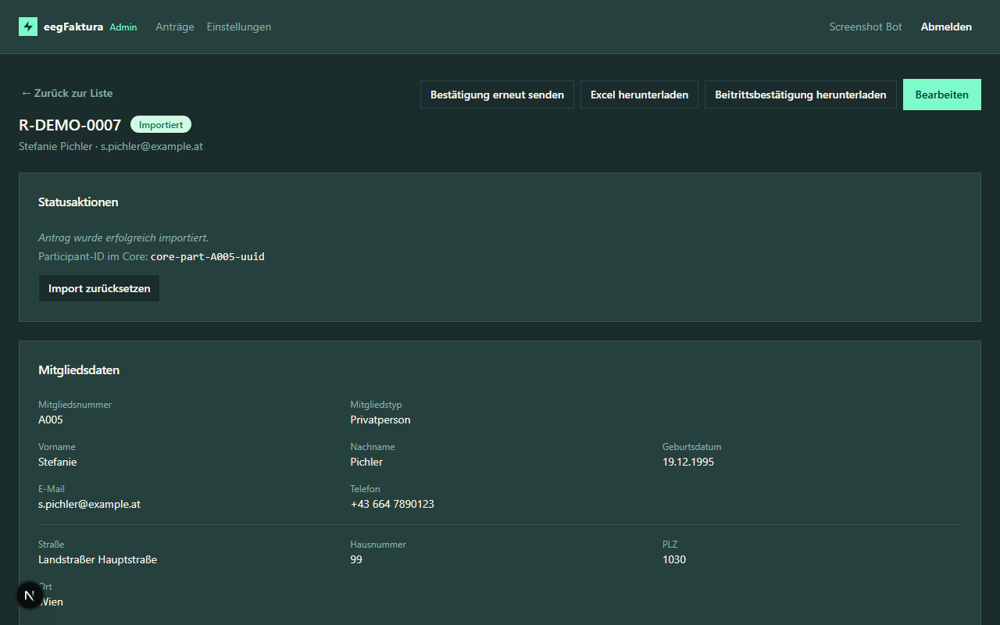

# Statusverwaltung

## Statusübergänge

Der Status eines Antrags steuert den Bearbeitungsablauf. Das Diagramm
zeigt die wichtigsten Übergänge für den Bearbeitungsalltag — die
zwei-Phasen-Übersicht (Review + Post-Import) steht im
[Überblick](index.md#antragsstatus-im-uberblick).

> **Skip-Import:** Der direkte Weg `approved → activated` ist ein
> Ausnahmefall — der Admin verwendet ihn, wenn das Mitglied im
> eegFaktura-Core bereits manuell angelegt/überschrieben wurde und der
> reguläre Import-Pfad übersprungen werden soll.

* `import_failed → approved`: nach Fehlerbehebung kann der Import erneut versucht werden.
* `imported` ist **transient** — der Server transitioniert sofort weiter (siehe Diagramm oben). Wenn ein Antrag in `imported` „hängen" bleibt, ist der Auto-Branch fehlgeschlagen → über **Import zurücksetzen** lösen.
* `imported / awaiting_bank_confirmation / ready_for_activation → approved`: über die Aktion **Import zurücksetzen** (siehe unten). NICHT aus `activated` — aktive Mitglieder müssen zuerst im Core deaktiviert werden.

## Status ändern

In der Detailansicht eines Antrags findest du den Bereich **Status-Aktionen**.

Klicke auf die gewünschte Aktion. Je nach aktuellem Status stehen unterschiedliche Aktionen zur Verfügung:

| Aktueller Status | Mögliche Aktionen |
|-----------------|-------------------|
| `submitted` | In Bearbeitung nehmen, Ablehnen *(bei aktiver E-Mail-Bestätigung nur „Ablehnen", bis das Mitglied bestätigt)* |
| `email_confirmed` | In Bearbeitung nehmen, Rückfragen stellen, Ablehnen |
| `under_review` | Genehmigen, Rückfragen stellen, Ablehnen |
| `needs_info` | — (wartet auf Ergänzung durch das Mitglied) |
| `approved` | Import starten |
| `import_failed` | Import erneut starten |
| `imported` | Import zurücksetzen *(nur sichtbar wenn Auto-Branch fehlgeschlagen)* |
| `awaiting_bank_confirmation` | **Bank-Bestätigung erhalten**, Zurück in Bearbeitung, Import zurücksetzen |
| `ready_for_activation` | **Als aktiv markieren**, Zurück in Bearbeitung, Import zurücksetzen *(oder via Batch-Button „Aktivierung im Core prüfen" in der Liste)* |
| `activated` | — (Endzustand, keine Aktionen möglich) |

Bei `approved` gibt es zwei Buttons: **„In eegFaktura importieren"** (Standard) und **„Manuell aktivieren …"** (Ausnahmefall — überspringt den Import, falls das Mitglied im Faktura bereits manuell überschrieben wurde; siehe unten).

Zusätzlich verfügbar in allen Review-Stati (`submitted` / `email_confirmed` / `under_review` / `needs_info`) für Admins mit Zugriff auf ≥ 2 EEGs:

| Aktion | Wirkung |
|--------|---------|
| **EEG umzuordnen** | Verschiebt den Antrag in eine andere EEG (siehe Abschnitt unten) |

## E-Mail-Bestätigung (`email_confirmed`)

Wenn in den EEG-Einstellungen **„E-Mail-Adresse bestätigen"** aktiviert ist, erscheinen neue Anträge zunächst im Status `submitted` mit dem Hinweis **„E-Mail-Adresse noch nicht bestätigt"**. Solange der Bewerber den Link in der Bestätigungs-Mail nicht angeklickt hat, ist der einzig verfügbare Status-Schritt **„Ablehnen"** (für offensichtlichen Spam).

Sobald der Bewerber klickt:

- Status wechselt automatisch auf `email_confirmed`
- Du erhältst die EEG-Benachrichtigungs-Mail mit den Antragsdaten
- Alle normalen Status-Aktionen (In Bearbeitung nehmen, Rückfragen, Genehmigen, Ablehnen) sind ab jetzt verfügbar

**Bestätigungs-Link erneut senden**: Sollte das Mitglied den Link nicht finden (z. B. Spam-Ordner), nutze in der Detail-Seite oben rechts **„Bestätigungs-Link erneut senden"**. Das generiert ein neues Token; der alte Link wird ungültig. Min. 5 Minuten Wartezeit zwischen zwei Sendungen.

**Automatische Ablehnung**: Anträge, deren Bestätigung 30 Tage lang ausbleibt, werden vom System automatisch auf `rejected` gesetzt mit dem Grund „E-Mail-Bestätigung ausgeblieben (Auto-Reject nach 30 Tagen)".

## In Bearbeitung nehmen (`under_review`)

Nimm einen eingereichten Antrag in Bearbeitung, um anzuzeigen, dass du ihn aktiv bearbeitest. Dies ist optional, hilft aber wenn mehrere Admins auf dieselbe EEG arbeiten.

## Rückfragen stellen (`needs_info`)

Wenn Angaben fehlen oder unklar sind:

1. Klicke auf **Rückfragen stellen**
2. Gib den Grund / die Rückfrage ein — der blaue Hinweis im Dialog erinnert daran: **„Der hier eingegebene Text wird per E-Mail an den Beitrittswerber übermittelt"**
3. Das Mitglied erhält eine E-Mail mit deiner Rückfrage 1:1 im Body und kann seinen Antrag ergänzen
4. **Hard-Fail (ab 2026-05-17):** scheitert der SMTP-Versand, wird der Statuswechsel zurückgerollt und du siehst die Fehlermeldung direkt im Dialog. Status bleibt unverändert, du kannst nach SMTP-Recovery erneut klicken

Nach der Ergänzung durch das Mitglied wechselt der Status automatisch zurück auf `submitted`.

> **Hinweis zum Mail-Footer (seit 2026-05-18):** Der Footer in den Member-Mails (Eingangsbestätigung, Rückfragen, Ablehnung) verweist auf die **EEG-Kontakt-E-Mail** als `mailto:`-Link statt der bisherigen Postadresse. Antworten gehen weiter direkt an deine EEG (Reply-To bleibt unverändert) — der Link ist nur eine zusätzliche Komfort-Option für Mitglieder, die nicht via Antwort sondern via neue Mail kontaktieren wollen.

## Genehmigen (`approved`)

Wenn alle Angaben korrekt und vollständig sind:

1. Klicke auf **Genehmigen**
2. Der Antrag wechselt auf `approved` und ist bereit für den Import in eegFaktura

## Ablehnen (`rejected`)

Wenn ein Antrag nicht genehmigt werden kann:

1. Klicke auf **Ablehnen**
2. Gib einen Ablehnungsgrund an — der blaue Hinweis im Dialog erinnert daran: **„Die hier eingegebene Begründung wird per E-Mail an den Beitrittswerber übermittelt"**
3. Das Mitglied erhält eine E-Mail mit deiner Begründung 1:1 im Body
4. **Hard-Fail:** gleiches Verhalten wie bei Rückfragen — Mail-Fehler rollt den Statuswechsel zurück

## Import in eegFaktura

Nach der Genehmigung kann der Antrag in eegFaktura importiert werden:

1. Öffne den genehmigten Antrag
2. Klicke auf **In eegFaktura importieren**
3. Es öffnet sich der Dialog **Import-Konfiguration**:
   * **Tarif** — Auswahl aus den im eegFaktura-Core hinterlegten Tarifen der EEG
   * **Mitgliedsnummer** — Vorbelegt mit der nächsten freien Nummer (basierend auf dem dominanten Muster in eegFaktura, z. B. `A005 → A006` oder `12 → 13`). Maximal 50 Zeichen, alphanumerisch erlaubt. Du kannst den Vorschlag übernehmen oder überschreiben.
4. Klicke auf **Importieren**
5. Bei Erfolg wechselt der Status auf `imported`
6. Bei Fehler wechselt der Status auf `import_failed` — der Import kann wiederholt werden (Mitgliedsnummer und Tarif werden erneut abgefragt)

> **Hinweis:** Die Mitgliedsnummer wird erst beim Import vergeben. Im Status `submitted` / `under_review` / `approved` ist sie noch leer — das ist beabsichtigt, weil nur eegFaktura die endgültige Nummern­vergabe steuert.

> **Hinweis:** Der Import kann bei technischen Problemen mit eegFaktura fehlschlagen. In diesem Fall prüfe den Fehlerhinweis und wiederhole den Import, sobald das Problem behoben ist.

## Hängengebliebener Import

Wenn ein Import-Versuch nicht sauber abschließt — z.B. weil eine Datenbank-Eindeutigkeitsverletzung den Bookkeeping-Schritt nach dem Core-Aufruf scheitern lässt, oder weil das Onboarding-Backend mitten im Import abstürzt — bleibt der Antrag im Status `approved`, kann aber nicht erneut importiert werden (das System meldet 409 „Import läuft bereits").

In diesem Fall erscheint im Antrags-Detail ein **oranger Banner** mit zwei Recovery-Aktionen:

- **„Als importiert markieren"** — wenn der Teilnehmer im Core trotzdem angelegt wurde (im eegFaktura-Core nachschauen, Teilnehmer-UUID und vergebene Mitgliedsnummer notieren). Trage beides im Dialog ein; der Antrag wechselt sauber auf `imported`.
- **„Import-Lock räumen (Retry)"** — wenn du sicher bist, dass im Core kein Teilnehmer angelegt wurde (oder du ihn vorher manuell gelöscht hast). Setzt den Lock zurück, der Antrag bleibt auf `approved`, ein erneuter Import wird möglich. **Achtung**: Bei vorhandenem Core-Teilnehmer entsteht beim Retry ein Duplikat.

Der Banner erscheint automatisch, sobald der Import-Versuch älter als 2 Minuten ist und nicht sauber abgeschlossen wurde — du musst nicht raten, ob „nochmal probieren" sicher ist.

## Import zurücksetzen (`imported / awaiting_bank_confirmation / ready_for_activation → approved`)

Wenn ein bereits importierter Teilnehmer im eegFaktura-Core gelöscht wurde (z. B. weil das Mitglied seine Teilnahme widerrufen hat oder der Import fehlerhaft war), kann der Antrag in den Status `approved` zurückgesetzt werden, um einen Neu-Import zu ermöglichen.

1. Öffne den Antrag (Status `imported`, `awaiting_bank_confirmation` oder `ready_for_activation`)
2. Klicke auf **Import zurücksetzen**
3. Gib eine Begründung an (Pflichtfeld, wird im Statusverlauf protokolliert)
4. Der Antrag wechselt auf `approved`; die alte `target_participant_id`, die Mitgliedsnummer und alle Audit-Timestamps (`bank_confirmed_at`, `activated_at`) werden geleert und im Statusverlauf archiviert

> **Wichtig:** Diese Aktion kontaktiert den eegFaktura-Core *nicht*. Bevor du sie nutzt, musst du den Teilnehmer im Core manuell gelöscht haben.
>
> **Endzustand `activated` nicht resetbar:** ein aktives Mitglied muss zuerst im eegFaktura-Core deaktiviert werden — das Onboarding entfernt es nicht still.

## Post-Import-Stati

Nach erfolgreichem Import läuft der Antrag automatisch in einen der beiden Wartezustände, abhängig von der gewählten Einzugsart:

### `awaiting_bank_confirmation` — nur bei B2B-SEPA-Firmenlastschrift

Der Antrag landet hier, wenn `einzugsart=b2b` gesetzt ist. Das Mitglied hat per E-Mail das B2B-Firmenlastschrift-Mandat (mit eingedruckter Mandatsreferenz = Mitgliedsnummer) bekommen — und wurde aufgefordert, das Mandat seiner Hausbank vorzulegen. **Neuerdings** kommt mit dem Mandat eine schlanke Begleitmail („Anlage Mandat — Beitrittsbestätigung folgt") statt der vollen Beitrittsbestätigung; die volle Beitrittsbestätigungs-Mail mit PDF erhält das Mitglied erst, wenn der Antrag auf `activated` wechselt. Im Antrags-Detail erscheint eine prominente amber Hinweisbox „Warte auf Bank-Bestätigung".

> **Hinweis (seit 2026-05-18):** Beide SEPA-Mandate (Basislastschrift CORE und B2B-Firmenlastschrift) zeigen im Unterschriftsfeld jetzt das **Datum der Übermittlung** als vorbefülltes „Datum". Das Mitglied trägt nur noch Ort + Unterschrift ein. Das gleiche Datum wird im Antrags-Detail unter „Mandatsdatum" angezeigt und beim Faktura-Import als Mandate-Date mitgeführt.
>
> **Bugfix 2026-05-28:** bisher landeten Mandatsreferenz (= Mitgliedsnummer) und Mandatsdatum bei den at-import-Mandat-Flows (B2B-Firmenlastschrift und CORE mit Option „Mandat bei Import") nur lokal im Onboarding und im PDF, **nicht aber** im eegFaktura-Core. Admins mussten beide Werte nach jedem Import händisch im Core nachtragen. Jetzt setzt der Import beide Felder VOR dem Core-POST und sendet sie im `accountInfo`-Block mit. Bestandsanträge VOR dem Fix tragen die Werte weiterhin nur lokal — entweder per „Import zurücksetzen + neu importieren" überschreiben oder einmalig manuell im Core ergänzen.

**Aktion**: sobald sich das Mitglied bei dir meldet, klicke auf **„Bank-Bestätigung erhalten"** — der Antrag wechselt auf `ready_for_activation`, der Timestamp `bank_confirmed_at` wird gesetzt.

### `ready_for_activation` — bereit zur Aktivierung in der EEG

Der Antrag wird auf diesen Status gesetzt, sobald entweder (a) die Bank-Bestätigung erfolgt ist (B2B-Pfad) oder (b) automatisch direkt nach dem Import (alle anderen Einzugsarten). Das Mitglied ist jetzt im eegFaktura-Core angelegt und wartet darauf, vom Core-Team aktiviert zu werden.

**Zwei Wege zur Aktivierung:**
1. **Per Antrag manuell** — Klick auf **„Als aktiv markieren"** im Detail. Setzt den Status auf `activated` und stempelt `activated_at = NOW()`.
2. **Per Batch im Core prüfen** — Klick auf **„Aktivierung im Core prüfen"** in der Antragsübersicht (siehe Datei `04-admin-applications.md`). Iteriert alle eigenen `ready_for_activation`-Anträge, fragt pro Tenant einmal beim Core nach (`GET /participant`), und transitioniert diejenigen Anträge automatisch auf `activated`, deren EDA-Kriterium erfüllt ist.

**Welches EDA-Kriterium der Batch anwendet, ist pro EEG konfigurierbar:**
- **Variante A** (Default, `participant_active`): der Teilnehmer im Core hat den Status `ACTIVE`.
- **Variante B** (`any_meter_registration_started`): mindestens ein Zählpunkt im Core hat den `processState` in PENDING/APPROVED/ACTIVE — sprich der Netzbetreiber hat auf die Online-Registrierung mindestens geantwortet. Damit aktivieren EEGs schon dann, wenn die EDA-Anmeldung läuft, ohne auf den Abschluss zu warten.

Umschalten in den EEG-Einstellungen unter **„Aktivierungs-Kriterium"** (siehe `06-admin-settings.md`).

In beiden Fällen erhält das Mitglied beim Wechsel auf `activated` die **volle Beitrittsbestätigungs-Mail mit PDF**.

### `activated` — Endzustand

Aktives Mitglied. Kein Reset, keine Rückwärts-Übergänge — die Daten-Pflege findet jetzt im eegFaktura-Kernsystem statt. Im Antrags-Detail stehen zwei Aktionen zur Verfügung, um die Onboarding-Kopie konsistent zu halten:

#### Stammdaten aus eegFaktura abgleichen

Der Knopf „Stammdaten aus eegFaktura abgleichen" pullt den aktuellen Mitglieder-Datensatz aus dem Kernsystem und überschreibt in der Onboarding-Datenbank die Felder, in denen das Kernsystem inzwischen einen anderen Wert hält.

**Abgeglichen werden:**

- Vorname, Nachname, Titel (vor und nach), UID-Nummer
- Wohnort-Adresse (Straße, Hausnummer, PLZ, Ort)
- E-Mail-Adresse, Telefon
- IBAN, Kontoinhaber, Bankname

**Nicht abgeglichen werden:**

- Mitgliedstyp, Geburtsdatum, Beitrittsdatum
- Zählpunkte (die werden im Kernsystem eigenständig gepflegt)
- Anteile-Anzahl
- Status, Mandat-Felder, Einzugsart

**Klick-Flow:**

1. Klick auf „Stammdaten aus eegFaktura abgleichen". Der Knopf zeigt während des Abgleichs „Wird abgeglichen…".
2. Wenn nichts unterschiedlich ist: Toast „Stammdaten sind bereits synchron".
3. Wenn Felder unterschiedlich sind: Antrags-Detail wird sofort neu geladen mit den neuen Werten. Ein Toast bleibt 8 Sekunden sichtbar und nennt die geänderten Felder (z. B. „geänderte Felder: Telefon, PLZ (Wohnort), IBAN").
4. Im Status-Verlauf erscheint ein neuer Eintrag „Stammdaten aus eegFaktura abgeglichen (geänderte Felder: …)".

**Wenn ein Antrag manuell aktiviert wurde (ohne Import):** der Knopf ist ausgegraut mit Hinweis „Antrag wurde manuell aktiviert ohne Import — kein Faktura-Mitgliederlink, Abgleich nicht möglich".

#### SEPA-Mandat erneut senden

Wenn der Abgleich eine geänderte IBAN oder einen geänderten Kontoinhaber-Namen erkannt hat, ist das bestehende SEPA-Mandat **rechtlich nicht mehr gültig für die neue Bankverbindung** — ein neues Mandat muss vom Mitglied unterschrieben werden, bevor Lastschriften auf das neue Konto eingezogen werden dürfen.

Der Knopf „SEPA-Mandat erneut senden" generiert ein frisches Mandat-PDF mit der aktuell hinterlegten IBAN und versendet es an die Mitgliedsadresse. Subject und Wortlaut der Mail sind auf den Renewal-Kontext zugeschnitten („deine Bankverbindung wurde aktualisiert, hiermit erhältst du ein neues SEPA-Mandat-Formular").

**Klick-Flow:**

1. Klick auf „SEPA-Mandat erneut senden". Der Knopf zeigt „Mandat wird versandt…".
2. Bei Erfolg: Toast „SEPA-Mandat-Mail an Mitglied versandt". Im Status-Verlauf erscheint „SEPA-Mandat-Mail erneut versandt".
3. Bei Mail-Fehler: roter Toast „Mandat-Mail-Versand fehlgeschlagen — bitte später erneut versuchen". Der Status-Verlauf bleibt leer (kein Eintrag bei Fehler).

**Wann benutzen?**

- Nach einem Abgleich, der eine geänderte IBAN oder einen geänderten Kontoinhaber gemeldet hat.
- Wenn das Mitglied das Original-Mandat verloren hat und eine neue Kopie braucht.

Der Knopf ist nur sichtbar, wenn das Mitglied SEPA-Einzug nutzt (`Basislastschrift` oder `B2B-Firmenlastschrift`). Bei `Kein SEPA-Verfahren` erscheint der Knopf nicht.

### Ausnahmefall: `approved → activated` (manueller Skip-Import)

In seltenen Fällen existiert das Mitglied im eegFaktura-Core bereits (etwa weil ein altes Mitglied seinen Antrag erneuert hat — Faktura erlaubt kein Löschen von Mitgliedern). Wenn du das Core-Mitglied dort manuell mit den Onboarding-Daten überschrieben hast, fehlt im Onboarding noch der Statuswechsel.

Im Detail einer `approved`-Anwendung erscheint dafür neben „In eegFaktura importieren" ein zweiter Button **„Manuell aktivieren …"**:

1. Klick öffnet einen Dialog mit Warnhinweis „Nur verwenden, wenn das Mitglied im eegFaktura bereits manuell überschrieben wurde".
2. Pflichtfeld **Mitgliedsnummer** — die im Faktura hinterlegte Nummer wird auf die Beitrittsbestätigung gedruckt.
3. Bestätigen → der Antrag wechselt direkt von `approved` auf `activated`. Der Import in den Core wird übersprungen. Es geht **dieselbe** Beitrittsbestätigungs-Mail mit PDF raus wie beim regulären Pfad.

Der Status-Log enthält den Eintrag „manuell aktiviert (Core-Member bereits vorhanden, Import übersprungen)" mit der gesetzten Mitgliedsnummer.

## EEG umzuordnen

Wenn ein Mitglied über den falschen RC-Link der EEG A registriert hat, aber eigentlich zur EEG B gehört (z. B. weil das Versorgungsgebiet woanders hingehört), kann der Antrag direkt umzuordnen werden — ohne dass das Mitglied neu einreichen muss.

**Verfügbarkeit**: der Button **„EEG umzuordnen"** erscheint im Status-Aktionen-Block nur, wenn:
- der Status `submitted`, `email_confirmed`, `under_review` oder `needs_info` ist (nicht bei `approved` / `imported` / `rejected`)
- du als Admin Zugriff auf mindestens 2 EEGs hast

**Ablauf**:

1. Klicke auf **EEG umzuordnen**
2. Wähle die Ziel-EEG aus dem Dropdown (deine Tenants außer der aktuellen)
3. Gib eine Begründung an (Pflichtfeld, mindestens 5 Zeichen)
4. Bestätige mit **Umzuordnen**

**Was passiert**:
- Eine neue **Referenznummer** wird vom per-EEG-Counter der Ziel-EEG vergeben (Format `<neue-RC>-<Jahr>-<NNNN>`)
- Die alte Referenznummer und alte RC werden im Statusverlauf als `[system] previous rc_number=…` und `[system] previous reference_number=…` archiviert
- Der Status bleibt **unverändert** (kein Status-Wechsel)
- Der Antrag erscheint ab sofort in der Liste der Ziel-EEG, nicht mehr unter der alten EEG
- Es wird **keine E-Mail** an das Mitglied verschickt — die nächste Status-Mail (Rückfrage / Ablehnung / Zustimmung) kommt automatisch von der neuen EEG

**Wichtig**: Cooperative-Shares, Konfigurierbare-Felder und die E-Mail-Bestätigungs-Pflicht werden **nicht** re-validiert. Wenn die Ziel-EEG andere Pflichtfelder hat, nutze nach dem Umzuordnen ggf. **Rückfragen stellen**, um fehlende Daten nachzufordern.

## Statusverlauf

Jede Statusänderung wird automatisch im **Statusverlauf** protokolliert:

- Zeitpunkt der Änderung (Anzeige in Europe/Vienna mit CET/CEST-Umstellung)
- Von-Status und An-Status
- Benutzer der die Änderung vorgenommen hat
- Optionaler Grund (bei Rückfragen, Ablehnung und Import-Reset)

