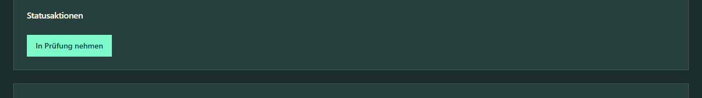
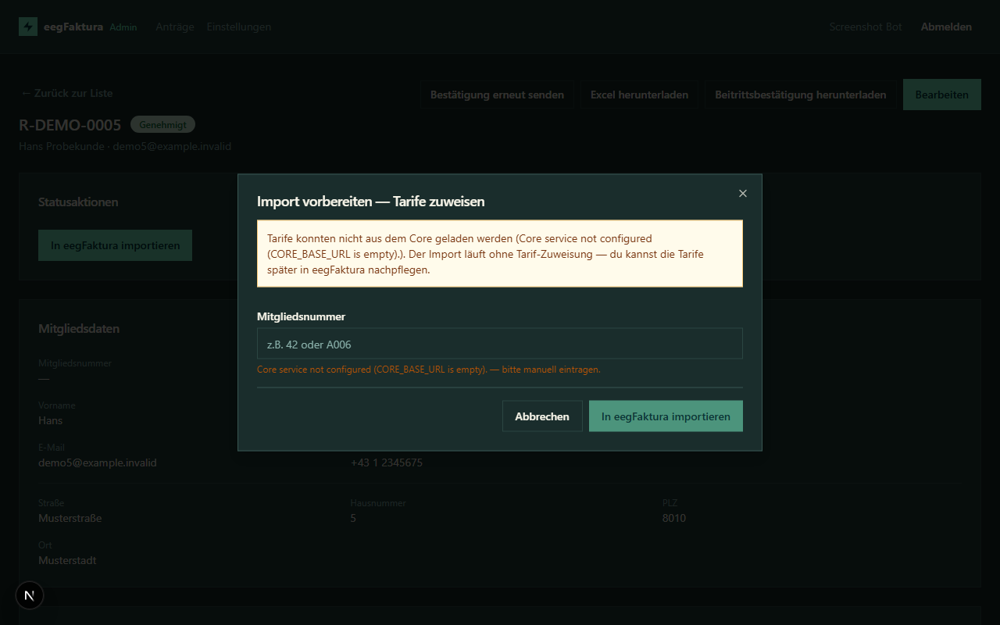
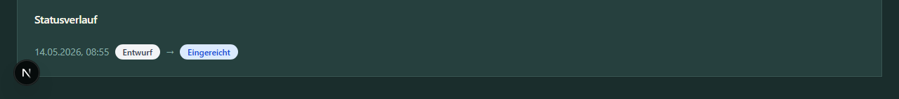

# Statusverwaltung

## Statusübergänge

Der Status eines Antrags steuert den Bearbeitungsablauf. Folgende Übergänge sind möglich:

```
submitted ──→ under_review ──→ approved ──→ imported
                   │                 │           │
                   │                 └──→ import_failed
                   │                              │
                   │              ┌───────────────┘
                   │              ↓
                   │           approved  (Import zurücksetzen)
                   │
                   ├──→ needs_info
                   │       └──→ submitted (nach Ergänzung durch Mitglied)
                   └──→ rejected
```

* `import_failed → approved`: nach Fehlerbehebung kann der Import erneut versucht werden.
* `imported → approved`: über die Aktion **Import zurücksetzen** (siehe unten) — z. B. wenn der Teilnehmer im eegFaktura-Core manuell gelöscht und neu importiert werden soll.

## Status ändern

In der Detailansicht eines Antrags finden Sie den Bereich **Status-Aktionen**.



Klicken Sie auf die gewünschte Aktion. Je nach aktuellem Status stehen unterschiedliche Aktionen zur Verfügung:

| Aktueller Status | Mögliche Aktionen |
|-----------------|-------------------|
| `submitted` | In Prüfung nehmen, Ablehnen *(bei aktiver E-Mail-Bestätigung nur „Ablehnen", bis das Mitglied bestätigt)* |
| `email_confirmed` | In Prüfung nehmen, Rückfragen stellen, Ablehnen |
| `under_review` | Genehmigen, Rückfragen stellen, Ablehnen |
| `needs_info` | — (wartet auf Ergänzung durch das Mitglied) |
| `approved` | Import starten |
| `import_failed` | Import erneut starten |
| `imported` | Import zurücksetzen |

## E-Mail-Bestätigung (`email_confirmed`)

Wenn in den EEG-Einstellungen **„E-Mail-Adresse bestätigen"** aktiviert ist, erscheinen neue Anträge zunächst im Status `submitted` mit dem Hinweis **„E-Mail-Adresse noch nicht bestätigt"**. Solange der Bewerber den Link in der Bestätigungs-Mail nicht angeklickt hat, ist der einzig verfügbare Status-Schritt **„Ablehnen"** (für offensichtlichen Spam).

Sobald der Bewerber klickt:

- Status wechselt automatisch auf `email_confirmed`
- Sie erhalten die EEG-Benachrichtigungs-Mail mit den Antragsdaten
- Alle normalen Status-Aktionen (In Prüfung nehmen, Rückfragen, Genehmigen, Ablehnen) sind ab jetzt verfügbar

**Bestätigungs-Link erneut senden**: Sollte das Mitglied den Link nicht finden (z. B. Spam-Ordner), nutzen Sie in der Detail-Seite oben rechts **„Bestätigungs-Link erneut senden"**. Das generiert ein neues Token; der alte Link wird ungültig. Min. 5 Minuten Wartezeit zwischen zwei Sendungen.

**Automatische Ablehnung**: Anträge, deren Bestätigung 30 Tage lang ausbleibt, werden vom System automatisch auf `rejected` gesetzt mit dem Grund „E-Mail-Bestätigung ausgeblieben (Auto-Reject nach 30 Tagen)".

## In Prüfung nehmen (`under_review`)

Nehmen Sie einen eingereichten Antrag in Prüfung, um anzuzeigen, dass Sie ihn aktiv bearbeiten. Dies ist optional, hilft aber wenn mehrere Admins auf dieselbe EEG arbeiten.

## Rückfragen stellen (`needs_info`)

Wenn Angaben fehlen oder unklar sind:

1. Klicken Sie auf **Rückfragen stellen**
2. Geben Sie den Grund / die Rückfrage ein
3. Das Mitglied erhält eine E-Mail und kann seinen Antrag ergänzen

Nach der Ergänzung durch das Mitglied wechselt der Status automatisch zurück auf `submitted`.

## Genehmigen (`approved`)

Wenn alle Angaben korrekt und vollständig sind:

1. Klicken Sie auf **Genehmigen**
2. Der Antrag wechselt auf `approved` und ist bereit für den Import in eegFaktura

## Ablehnen (`rejected`)

Wenn ein Antrag nicht genehmigt werden kann:

1. Klicken Sie auf **Ablehnen**
2. Geben Sie einen Ablehnungsgrund an (wird intern gespeichert)

## Import in eegFaktura

Nach der Genehmigung kann der Antrag in eegFaktura importiert werden:

1. Öffnen Sie den genehmigten Antrag
2. Klicken Sie auf **In eegFaktura importieren**
3. Es öffnet sich der Dialog **Import-Konfiguration**:
   * **Tarif** — Auswahl aus den im eegFaktura-Core hinterlegten Tarifen der EEG
   * **Mitgliedsnummer** — Vorbelegt mit der nächsten freien Nummer (basierend auf dem dominanten Muster in eegFaktura, z. B. `A005 → A006` oder `12 → 13`). Maximal 50 Zeichen, alphanumerisch erlaubt. Sie können den Vorschlag übernehmen oder überschreiben.
4. Klicken Sie auf **Importieren**
5. Bei Erfolg wechselt der Status auf `imported`
6. Bei Fehler wechselt der Status auf `import_failed` — der Import kann wiederholt werden (Mitgliedsnummer und Tarif werden erneut abgefragt)



> **Hinweis:** Die Mitgliedsnummer wird erst beim Import vergeben. Im Status `submitted` / `under_review` / `approved` ist sie noch leer — das ist beabsichtigt, weil nur eegFaktura die endgültige Nummern­vergabe steuert.

> **Hinweis:** Der Import kann bei technischen Problemen mit eegFaktura fehlschlagen. In diesem Fall prüfen Sie den Fehlerhinweis und wiederholen Sie den Import, sobald das Problem behoben ist.

## Import zurücksetzen (`imported → approved`)

Wenn ein bereits importierter Teilnehmer im eegFaktura-Core gelöscht wurde (z. B. weil das Mitglied seine Teilnahme widerrufen hat oder der Import fehlerhaft war), kann der Antrag in den Status `approved` zurückgesetzt werden, um einen Neu-Import zu ermöglichen.

1. Öffnen Sie den importierten Antrag
2. Klicken Sie auf **Import zurücksetzen**
3. Geben Sie eine Begründung an (Pflichtfeld, wird im Statusverlauf protokolliert)
4. Der Antrag wechselt auf `approved`; die alte `target_participant_id` wird im Statusverlauf archiviert

> **Wichtig:** Diese Aktion kontaktiert den eegFaktura-Core *nicht*. Bevor Sie sie nutzen, müssen Sie den Teilnehmer im Core manuell gelöscht haben.

## Statusverlauf

Jede Statusänderung wird automatisch im **Statusverlauf** protokolliert:

- Zeitpunkt der Änderung (Anzeige in Europe/Vienna mit CET/CEST-Umstellung)
- Von-Status und An-Status
- Benutzer der die Änderung vorgenommen hat
- Optionaler Grund (bei Rückfragen, Ablehnung und Import-Reset)


