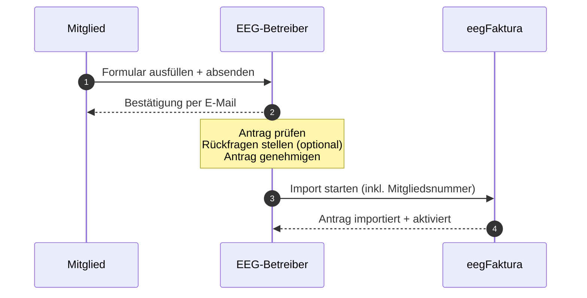
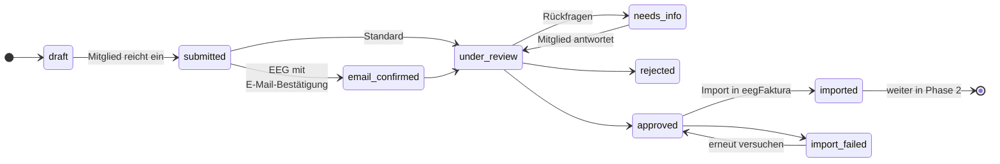
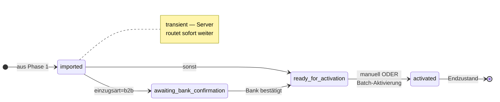

# eegFaktura Mitglieder-Onboarding — Überblick

## Was ist das Tool?

Das eegFaktura Mitglieder-Onboarding ist ein **Datenerfassungs-, Prüfungs- und Kommunikationstool für Beitrittskandidaten einer Energiegemeinschaft**. Neue Interessenten füllen ein öffentlich zugängliches Webformular aus, das über einen individuellen Link der jeweiligen EEG erreichbar ist. Der EEG-Betreiber prüft den Antrag, klärt offene Punkte direkt im Tool und gibt die Daten anschließend an ein externes Zielsystem weiter — typischerweise an eegFaktura, optional an weitere Systeme über das Plugin-System (siehe „Datenweiterleitung" weiter unten).

## Was das Tool NICHT ist

Damit das Zusammenspiel mit anderen Systemen sauber funktioniert, hier die bewusste Abgrenzung:

- **Keine Mitgliederverwaltung.** Sobald ein Antrag an das Zielsystem übergeben wurde, lebt die dauerhafte Mitgliedschaft dort, nicht hier. Änderungen am bestehenden Mitglied (Adresse, Bankverbindung, Tarif, Vertrag, …) werden im Zielsystem gepflegt.
- **Kein dauerhafter Datenspeicher.** Die Antrags-Datensätze im Onboarding sind nach der Übergabe an das Zielsystem **Übergangs-Daten**. Sie bleiben aus Audit- und Reset-Gründen zwar verfügbar, sind aber nicht als langfristige Quelle der Wahrheit gedacht. Für historische Auswertungen, Reports und das tägliche Mitglieder-Geschäft ist das Zielsystem zuständig.
- **Keine Auswertungs- oder Analyse-Tools.** Es gibt keine Statistik-Dashboards, kein BI-Modul, keine Mitglieder-Abfrage über Filter-Sets, kein Mitglieder-Cockpit. Wer Reporting braucht, holt es sich in dem System, in das die Daten weitergeleitet wurden.

Diese Trennung ist Absicht: Das Onboarding will den Aufnahmeprozess **bis zur sauberen Übergabe** kanalisieren — alles andere gehört woanders hin und wird absichtlich nicht doppelt gebaut.

## Konkreter Nutzen für die EEG

Aus Pilot-Rückmeldungen ist das der gefühlte Kern-Mehrwert: **„neue Mitglieder über eine einfache Formularmaske sauber in eegFaktura bekommen — ohne die typischen Fehlerquellen der manuellen Aufnahme."** Konkret:

- **Strukturierte Erfassung statt E-Mail-Anhänge.** Pflichtfelder, Format-Validierung (IBAN, UID, Zählpunkt) und konsistente Adress-/Bank-Datensätze werden im Formular abgefangen — nicht erst beim Import bemerkt.
- **Ein Klick statt manueller Tipparbeit.** Der Import in eegFaktura läuft über einen Button im Antrag; Mitglieds-Stammdaten, Zählpunkte, SEPA-Mandat landen ohne Re-Tipparbeit im Core. Daher keine Tippfehler beim Übertragen.
- **Mitglieds-Kommunikation ist Teil des Workflows.** Rückfragen, Bestätigungen, Beitritts-PDFs gehen aus dem Tool — ohne Medienbruch zum E-Mail-Programm.
- **Audit-Trail bis zur Übergabe.** Jeder Status-Schritt vom Einreichen bis zum Aktivieren wird mit Zeitstempel + Aktor protokolliert (für FA-Prüfung, interne Rückverfolgung).

## Datenweiterleitung

Die erfassten Antragsdaten lassen sich auf zwei Wegen an Folgesysteme übergeben:

1. **Direkter Import in eegFaktura** — der Standard-Pfad. Ein Klick auf „In eegFaktura importieren" im Antrag erzeugt den Teilnehmer im Core inklusive Zählpunkten, Bankverbindung und SEPA-Mandat.
2. **Plugin-basierte Datenweiterleitung** an beliebige andere Systeme. Heute ist als erstes Plugin der **Excel-/CSV-Export** verfügbar — mit frei konfigurierbarem Spalten-Mapping pro Zielsystem. Künftige Plugins (z. B. CRM-Anbindungen wie HubSpot oder Zoho) folgen demselben Muster: konfigurieren → Antrag auswählen → Plugin-Aktion auslösen.

Details: [Admin-Einstellungen — Datenweiterleitung](06-admin-settings.md).

## Wie funktioniert der Prozess?

> **Hinweis:** Die **Mitgliedsnummer** wird nicht beim Einreichen, sondern erst beim Import in eegFaktura vergeben. Das eegFaktura-Core schlägt die nächste freie Nummer vor (numerisch oder alphanumerisch, z. B. `A006`), die der EEG-Betreiber im Import-Dialog übernehmen oder anpassen kann.

## Benutzerrollen

| Rolle | Zugang | Berechtigungen |
|-------|--------|----------------|
| **Mitglied** | Öffentlicher Registrierungslink | Antrag einreichen, Rückfragen beantworten |
| **EEG-Betreiber** | Admin-Oberfläche (Keycloak-Login) | Anträge prüfen, Status ändern, in eegFaktura importieren |

## Antragsstatus im Überblick

Der Lebenszyklus eines Antrags teilt sich in zwei Phasen: die **Review-Phase** bis zum Import in eegFaktura, und die **Post-Import-Phase** bis zur Aktivierung des Mitglieds.

### Phase 1 — Review (bis Import)

### Phase 2 — Post-Import (bis Aktivierung)

Aus den Stati `imported`, `awaiting_bank_confirmation` und `ready_for_activation` ist über die Aktion **Import zurücksetzen** ein Rückweg nach `approved` möglich — siehe [Statusverwaltung](05-admin-status.md#import-zurucksetzen-imported-awaiting_bank_confirmation-ready_for_activation-approved). Aus `activated` gibt es keinen Reset; ein aktives Mitglied muss zuerst im eegFaktura-Core deaktiviert werden.

Details zu den einzelnen Übergängen:

* `submitted → email_confirmed`: nur wenn die EEG **E-Mail-Bestätigung erforderlich** aktiviert hat — Mitglied klickt den Bestätigungs-Link in der Willkommens-Mail.
* `import_failed → approved`: nach Fehlerbehebung kann der Import erneut versucht werden.
* `imported` ist **transient** (nur Millisekunden) — der Server transitioniert sofort weiter abhängig von `einzugsart=b2b`:
  - **b2b:** `imported → awaiting_bank_confirmation` (Admin wartet auf Mitglied-Rückmeldung zur Hausbank-Pre-Notification, dann manuell weiter)
  - **sonst:** `imported → ready_for_activation` (direkt nach Aktivierung im Core bereit)
* `ready_for_activation → activated`: Admin klickt manuell „Als aktiv markieren" ODER nutzt den Batch-Button „Aktivierung im Core prüfen" in der Antragsliste.
* `activated` ist **strikter Endzustand**: keine Übergänge raus, kein Reset. Deaktivierung erfolgt direkt im Core.
* `imported / awaiting_bank_confirmation / ready_for_activation → approved`: über die Aktion **Import zurücksetzen** in der Detailansicht. NICHT aus `activated`.

| Status | Bedeutung |
|--------|-----------|
| `draft` | Vom Mitglied begonnen, noch nicht eingereicht |
| `submitted` | Vom Mitglied eingereicht, wartet auf Prüfung (oder auf E-Mail-Bestätigung, wenn aktiviert) |
| `email_confirmed` | Mitglied hat den Bestätigungs-Link geklickt; Antrag wartet auf EEG-Prüfung |
| `under_review` | EEG-Betreiber prüft den Antrag |
| `needs_info` | EEG-Betreiber hat Rückfragen gestellt |
| `approved` | Antrag genehmigt, bereit für Import |
| `rejected` | Antrag abgelehnt |
| `imported` | Erfolgreich in eegFaktura importiert (transient, Auto-Routing direkt danach) |
| `import_failed` | Import fehlgeschlagen, kann wiederholt werden |
| `awaiting_bank_confirmation` | (B2B-SEPA) Mitglied muss sein B2B-Mandat bei der Hausbank hinterlegen, EEG-Admin wartet auf Bestätigung |
| `ready_for_activation` | Bereit zur finalen Aktivierung in der EEG |
| `activated` | Aktives Mitglied — Endzustand |
